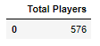
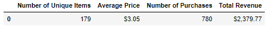
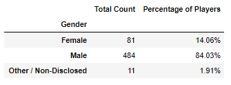
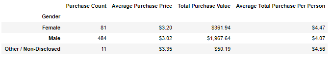
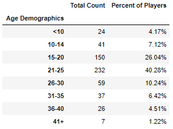
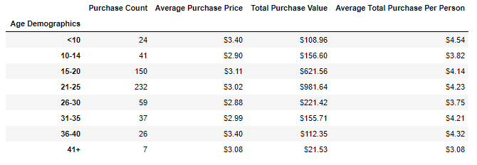
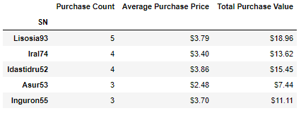
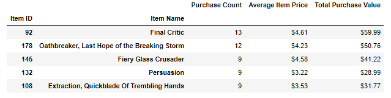
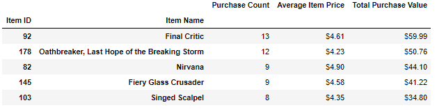

# Pandas
Panda's Gaming Analysis of Fantasy game 'Heroes of Pymoli'

The below analysis explores player data from an Independent Gaming companies most recent fantasy game: ‘Heroes of Pymoli’. Like many other games in the Fantasy genre, the game is free-to-play, but players are encouraged to purchase optional items that enhance their playing experience. 

Using `Pandas`, I have evaluated the players purchasing habits by gender and by age to draw conclusions as to the most likely player category to spend money in the game. I also reviewed the most popular and profitable items sold. 

## Table of contents
* [Data Summary](#data-summary)
* [Gender Demographics](#gender-demographics)
* [Age Demographics](#age-demographics)
* [Top Spenders](#top-spenders)
* [Best Items](#best-items)
* [Conclusion](#conclusion)
* [Jupyter Notebook](#jupyter-notebook)
* [Contact](#contact)

## Data Summary

I used a `.nunique()` count function to count the total number of users playing the game. 

I used basic calculations like `.sum()` and `.mean()` to calculate the total revenue spent in the game and average purchase price of items.

## Gender Demographics

I used a `.groupby` function to group the player data by gender to evaluate the amount of players and their spending habits based on their gender. I then calucated the percentage of players in each gender. 

I formatted the results using a `.map("{:,.2f}%".format` function. As you can see below, men make up 84% of the player base. 

As you can see from the below breakdown of spending habits by gender, although the men spent almost 6x more money than women did as a group, the average purchase price and total purchase price per player is higher for women. These results are in line with the total number of players by gender which show that men represent over ¾ of the players. 

I used the `.map("${:,.2f}".format` function to display my results in currency. 

## Age Demographics

For the analysis of players by age, I used the `bins` function to group the data into age brackets of 5 years. I used the `pd.cut` function to create a table highlighting age demographics. As you can see, player ages 15-30 make up ¾ of the player total. Ages 21-25 are almost ½ of total player. 

I used similar calculations and functions as with gender demographics to analyze the spending habits of the players by age. With the data grouped in `bins` by age, you can see that although players within the most common age group of 15-30 have spent the most money, players under the age of 10 have actually spent the most per person in the game and have the highest average purchase price per item. 

## Top Spenders

To calculate the top spending players in the game, I used the `groupby` function to group the players by their screen name. By doing this, I can see if players have made multiple purchase and add up the total purchase value by player. The top player is Lisosia93 who has made 5 item purchases totaling $18.96. 

## Best Items

The Most Popular items are the items that were purchased the most frequently. I created a new `DataFrame` which only referenced the Item ID, Item Name and Item Price. With this information I was able to use a `groupby` function of the Item ID and Item Name to see the number of times the item was purchased the total sales the item made. 

The most profitable item was calculated in a similar format accept I used the total purchase value column to determine which item had the highest total revenue. The Most Popular Item is the same as the most profitable which makes sense since it has been purchased with the most frequency. 

## Conclusion

By analyzing the Fantasy Video game Heroes of Pymoli’s player data, I am able conclude the following:

The players of this game are predominantly male, making up 84% of the total players. The male players also account for over ¾ of total purchasing however the female players have a higher average purchase cost. 

Players within the age brackets of 15-30 make up ¾ of the total players. Although they only make up about 4% if the total, players age 10 and under actually have the highest average purchase price. 

The most popular item purchased in the game is also the most profitable item purchased. This makes sense as it is the item purchased the most times. 

The most profitable demographic in this game are men between the age of 21-25. Female players tended to spend more money per player/item, so to increase profitability, the gaming company should try to target more female players. 

## Jupyter Notebook

https://github.com/Ssimoes48/Pandas-Challenge/blob/master/HeroesOfPymoli_Simoes.ipynb

## Contact
Sara Simoes

