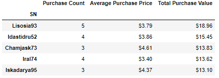

# Pandas-Challenge
Panda's Gaming Analysis of Fantasy game 'Heroes of Pymoli'

The below analysis explores player data from an Independent Gaming companies most recent fantasy game: ‘Heroes of Pymoli’. Like many other games in the Fantasy genre, the game is free-to-play, but players are encouraged to purchase optional items that enhance their playing experience. 

Using `Pandas`, I have evaluated the players purchasing habits by gender and by age to draw conclusions as to the most likely player category to spend money in the game. I also reviewed the most popular and profitable items sold. 

## Table of contents
* [Data Summary](#data-summary)
* [Gender Info](#gender-info)
* [Age Info](#age-info)
* [Top Spenders](#top-spenders)
* [Best Items](#best-items)
* [Conclusion](#conclusion)
* [Jupyter Notebook](#jupyter-notebook)
* [Contact](#contact)

## Data Summary

I used a `.nunique()` count function to count the total number of users playing the game. 

I used basic calculations like `.sum()` and `.mean()` to calculate the total revenue spent in the game and average purchase price of items.

## Gender Info

I used a `.groupby` function to group the player data by gender to evaluate the amount of players and their spending habits based on their gender. I then calucated the percentage of players in each gender. 

I formatted the results using a `.map("{:,.2f}%".format` function. As you can see below, men make up 84% of the player base. 

As you can see from the below breakdown of spending habits by gender, although the men spent almost 6x more money than women did as a group, the average purchase price and total purchase price per player is higher for women. These results are in line with the total number of players by gender which show that men represent over ¾ of the players. 

I used the `.map("${:,.2f}".format` function to display my results in currency. 

## Age Info

For the analysis of players by age, I used the `bins` function to group the data into age brackets of 5 years. I used the `pd.cut` function to create a table highlighting age demographics. As you can see, player ages 15-30 make up ¾ of the player total. Ages 21-25 are almost ½ of total player. 

I used similar calculations and functions as with gender demographics to analyze the spending habits of the players by age. With the data grouped in `bins` by age, you can see that although players within the most common age group of 15-30 have spent the most money, players under the age of 10 have actually spent the most per person in the game and have the highest average purchase price per item. 

## Top Spenders

## Best Items

## Conclusion

## Jupyter Notebook

## Contact
Sara Simoes 
